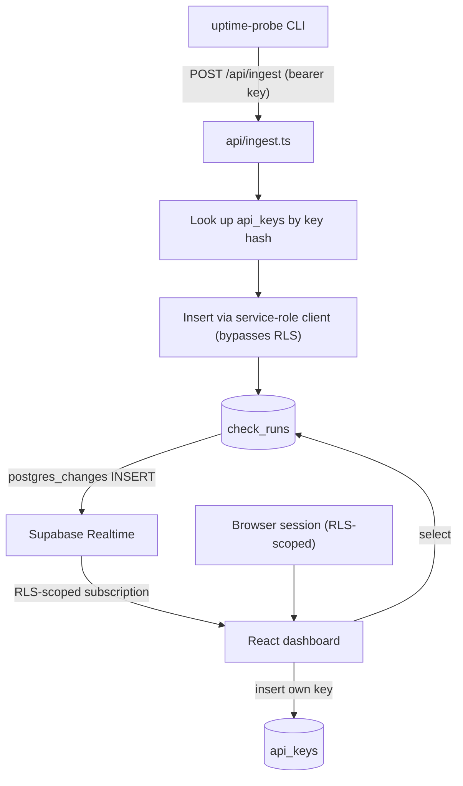

# Uptime Probe Dashboard

[](https://github.com/urielabin/uptime-probe-dashboard/actions/workflows/ci.yml)
[](LICENSE)

A hosted, multi-user dashboard for the [Uptime Probe](https://github.com/urielabin/uptime-probe) CLI — real accounts and Postgres persistence via Supabase, a bearer-token ingestion API, and a live-updating uptime/latency history per monitor with no custom WebSocket server.

## Architecture



## Stack

| Layer | Technology |
|---|---|
| Frontend | Vite + React 18 + TypeScript (strict) + Tailwind |
| Routing | react-router-dom |
| Auth + DB + Realtime | Supabase (Postgres, RLS, `postgres_changes`) |
| Ingestion API | One Vercel serverless function (`api/ingest.ts`) |
| Charts | Recharts |
| Landing page | GSAP + ScrollTrigger (matches the portfolio site's own hook) |
| Testing | Vitest (unit + real integration against local Supabase), Playwright (e2e) |
| CI | GitHub Actions + Supabase CLI's local dev stack |

## Design patterns

- **Two credential paths that never cross** — the browser talks to Supabase directly with the user's own session JWT (RLS-scoped, no custom read API); the CLI's machine credential (a hashed, revocable API key) only ever reaches the service-role client inside `api/ingest.ts`, never the browser bundle.
- **Realtime over polling** — `subscribeToNewRuns` (`src/lib/check-runs.ts`) uses Supabase's `postgres_changes` to stream new rows to the dashboard the moment the CLI pushes them. No WebSocket server, no polling loop.
- **Append-only snapshots, not deltas** — `uptime-probe`'s own metrics are cumulative per process; each push is stored as its own timestamped row rather than merged, so charting is just "query rows in order," with no delta math anywhere.
- **Client-side API key generation** — the raw key is generated and hashed entirely in the browser (`src/lib/api-keys.ts`); only the hash is ever sent to the database, via the user's own RLS-scoped insert. No serverless function is needed to mint a key.

## Commands

```bash
npm install
npx supabase start          # local Postgres/Auth/Realtime via Docker
npx playwright install --with-deps chromium
npm run dev                 # vite + local dev API server on :3001
npm test                    # unit tests (no DB needed)
npm run test:integration    # real HTTP against api/ingest.ts + real local Supabase
npm run test:e2e            # Playwright, against a built+previewed app
npm run lint
npm run typecheck
npm run build
```

Copy `.env.example` to `.env.local` and fill in the values `supabase start` prints (`API_URL` → `VITE_SUPABASE_URL`, `ANON_KEY` → `VITE_SUPABASE_ANON_KEY`, `SERVICE_ROLE_KEY` → `SUPABASE_SERVICE_ROLE_KEY`).

## Ingestion contract

```
POST /api/ingest
Authorization: Bearer <DASHBOARD_API_KEY>
Content-Type: application/json

{ "configName": "...", "summary": {...}, "thresholdResult": {...}, "narrative": "..." }
```

The body is `uptime-probe`'s `ReportContext`, verbatim — set `DASHBOARD_API_URL` (this endpoint) and `DASHBOARD_API_KEY` (generated on the `/settings/api-keys` page) on the CLI and every run is pushed automatically. Returns `201` on success, `401` for a missing/invalid/revoked key, `400` for a malformed payload.

## CI — what's real

| | Runs for real |
|---|---|
| `test` | Lint, typecheck, unit tests, build — no external services |
| `integration` | Real HTTP requests against the built `api/ingest.ts`, against a real local Postgres/Auth instance (`supabase start` in CI, Docker-based) — asserts inserts, RLS cross-user isolation, and auth failure paths for real |
| `e2e-smoke` | A real signup → real API key generation → real `POST /api/ingest` from a shell step (mirroring the CLI) → asserts the dashboard updates live with no page reload, proving the Realtime subscription actually fired |

Nothing here is mocked. The `integration`/`e2e-smoke` jobs take several minutes longer than a typical CI run for this kind of app, due to Docker image pulls for the local Supabase stack — a deliberate trade-off for real coverage on the first genuinely stateful, multi-user app in this portfolio, not a compromise.

**Not covered** (a real production deployment would need to add): data retention/pruning for `check_runs` (rows accumulate unbounded), production-scale load testing, backups, multi-region.
